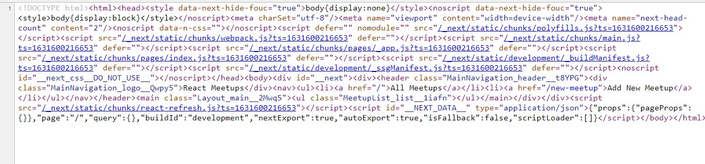
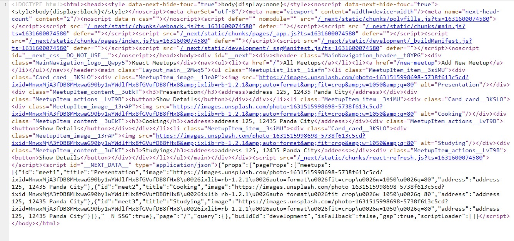

# Next.js

Next.js is a React framework which provides a solution for React project like server-side rendering.

You can see more information in [Next.js documentation](https://nextjs.org/docs/getting-started)

## Key features & Benefits

1. file-based routing - define pages and routes with files and folders instead of code which is less code, less work and highly understandable
2. server-side rendering - automatic page pre-rendering which great for SEO and initial load
3. Fullstack capabilities - easily add backend code to your Next/React apps which storing data, getting data, authentication etc. can be added to your React projects

## Installation

1. download Node.js
2. use npx to install
   ```
   npx create-next-app project-name
   ```

## Add Page in pages folder

You don't need to install react-router-dom to use router in Next project. Next has already set up all these things. Therefore, index.js is the first page in the root route which is yourdomain/. If you want to add yourdomain/new you have to create new.js in pages/new.js

You can also add nested paths like yourdomain/price/enterprise by create pages/price/enterprise/index.js or pages/price/enterprise.js

## Creating dynamic pages

1. Create [fileName].js in pages folder
2. import useRouter hook from next/router

```javascript
import { useRouter } from 'next/router';

function Task() {
  const router = useRouter();
  const taskId = router.query.taskId;
  return (
    <>
      <h1>Task</h1>
      <p>This is {taskId}</p>
    </>
  );
}

export default Task;
```

## Add HTML header and link between pages

- next/head allows you to add HTML header in Next.js
- next/link allows you to add Link component which link between pages. `<a></a>` and `<Link />` have a difference: `<a></a>` will cause page refreshing and request new HTML page but `<Link />` not cause page refreshing which make a smooth transition between pages.

```js
import Head from 'next/head';
import Link from 'next/link';

export default function Home() {
  return (
    <>
      <Head>
        <title>Create Next App</title>
        <meta name="description" content="Generated by create next app" />
        <link rel="icon" href="/favicon.ico" />
      </Head>
      <main>
        <h1>Next App</h1>
        <Link href="/todolist">Todo List</Link>
        <Link href="/todolist/addTask">addTask</Link>
      </main>
    </>
  );
}
```

## \_app.js file

This is a root file for passing props to every components or wrapping all components with wrapper component like navigation bar.

```js
import Layout from '../components/layout/Layout';
import '../styles/globals.css';

function MyApp({ Component, pageProps }) {
  return (
    <Layout>
      <Component {...pageProps} />
    </Layout>
  );
}

export default MyApp;
```

## Using programmatic (imperative) navigation

```js
// component
import { useRouter } from 'next/router';

import Card from '../ui/Card';
import classes from './MeetupItem.module.css';

function MeetupItem(props) {
  const router = useRouter();

  const showDetailsHandler = () => {
    router.push('/' + props.id);
  };

  return (
    <li className={classes.item}>
      <Card>
        <div className={classes.content}>
          <h3>{props.title}</h3>
          <address>{props.address}</address>
        </div>
        <div className={classes.actions}>
          <button onClick={showDetailsHandler}>Show Details</button>
        </div>
      </Card>
    </li>
  );
}

export default MeetupItem;
```

## Pre-rendering

When using pre-rendering, we will face the problem that the fetching data is not include in the HTML Page because pre-rendering will get the first elements that appear in the first lifecycle. It will not wait for data fetching.

However, Next.js provides a solution for us with Two forms of pre-rendering:

### Static Generation

pre-render when build your site for production. When you deploy the project, the pre-rendered page does not change by default. If the pre-rendered page need to change, it will have to build again. This technique use when the application is not change frequently.

If you need to add data fetching to a page component. You can add `getStaticProps()` inside page component (only in pages folder). It will call `getStaticProps()` function before it calls the component function. The job is to prepare the props for the component which contains all data that needed in that component. `getStaticProps()` can also be async function and Next.js will waits until the data is loaded. Therefore, the component can be rendered with required data.

The code in `getStaticProps()` will normally only run on a server like access a file system here, fetch data from API and connect to database but will not execute on client side. This code is executed during the build process. Thus, it will not reach the computer of the visitors.

#### Not using getStaticProps()

```js
// not using getStaticProps()
const HomePage = (props) => {
  const [loadedMeetups, setLoadMeetups] = useState([]);

  useEffect(() => {
    // fetching data from API
    // ...
    setLoadMeetups(data);
  }, []);

  return <MeetupList meetups={loadedMeetups} />;
};

export default HomePage;
```

Page Source



#### Using getStaticProps()

```js
// using getStaticProps() - no need to use useEffect and useState
const HomePage = (props) => {
  return <MeetupList meetups={props.meetups} />;
};

export function getStaticProps() {
  // fetching data from API
  // ...

  return {
    props: {
      meetups: data,
    },
  };
}

export default HomePage;
```

Page Source



#### getStaticPaths()

When you have dynamic routes in your project. You need to include `getStaticPaths()` in the dynamic page.

```js
// [meetupId].js
import MeetingUpDetail from '../components/meetups/MeetupDetail';

const MeetupDetails = (props) => {
  return (
    <>
      <MeetingUpDetail
        image={props.image}
        title={props.title}
        address={props.address}
        description={props.description}
      />
    </>
  );
};

// in case of dynamic page and using getStaticProps()
// because the dynamic url is not pre-generated
export async function getStaticPaths() {
  return {
    fallback: false,
    paths: [
      {
        params: {
          meetupId: 'meet1',
        },
      },
      {
        params: {
          meetupId: 'meet2',
        },
      },
      {
        params: {
          meetupId: 'meet3',
        },
      },
    ],
  };
}

export async function getStaticProps(context) {
  const meetupId = context.params.meetupId;

  return {
    props: {
      image:
        'https://images.unsplash.com/photo-1631515998698-5738f613c5cd?ixid=MnwxMjA3fDB8MHxwaG90by1wYWdlfHx8fGVufDB8fHx8&ixlib=rb-1.2.1&auto=format&fit=crop&w=1050&q=80',
      id: meetupId,
      title: 'Presentation',
      address: '123, Panda City',
      description: 'This is a presentation',
    },
  };
}

export default MeetupDetails;
```

### Building

When run `npm run build`, Next.js will show data about the project.

- Server - server-side renders at runtime (use getInitialProps or getServerSideProps)
- Static - automatically rendered as static HTML (use no initial props)
- SSG - automatically generated as static HTML + JSON (use getStaticProps) which be great for personal blogs because when the data are changed (current data will be outdated), you have to rebuild and deploy again.
- ISR - incremental static regeneration (uses revalidate in getStaticProps) which used in case of the data are changed more frequently (this is an alternative for SSG).

```js
// ISR
export function getStaticProps() {
  // fetching data from API
  // ...

  return {
    props: {
      meetups: data,
    },
    // Next.js will generate this page every 10 seconds
    // ensure that the data will not be outdated or older than 10 seconds
    revalidate: 10,
  };
}
```

### Server-side Rendering

#### getServerSideProps()

Sometimes, regular update with ISR is not enough. You may need to regenerate the page for every incoming request. Therefore, Next.js provides `getServerSideProps()` which not run during the build process but always run on the server after deployment.

```js
export async function getServerSideProps(context) {
  const req = context.req;
  const res = context.res;
  // fetch data from an API
  // ...

  return {
    props: {
      meetups: data,
    },
  };
}
```
